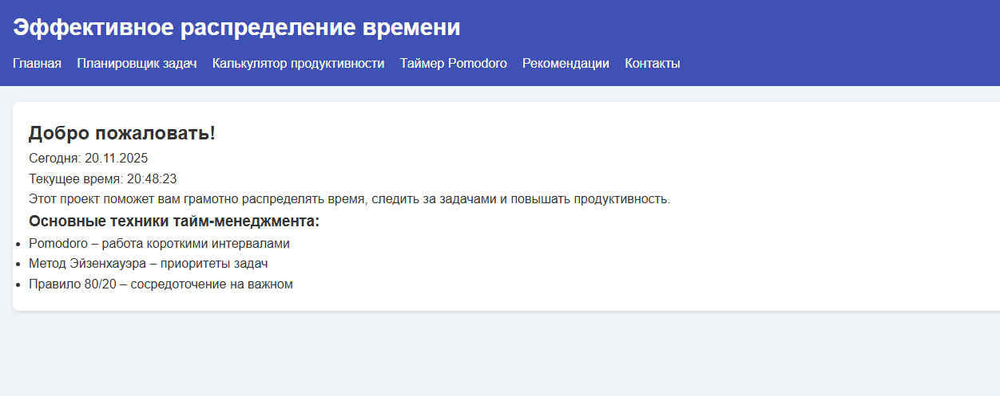
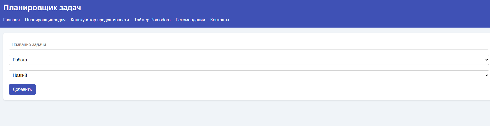
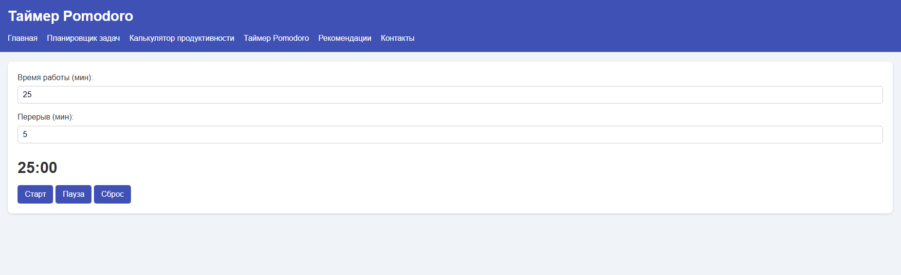
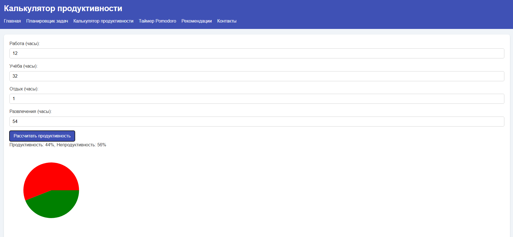
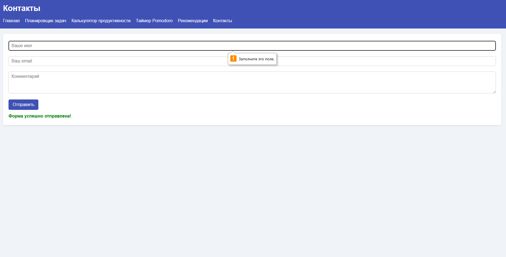

# Time Management Web Project

A complete multi‑page web application designed to help users manage time effectively.  
Includes task tracking, Pomodoro timer, productivity techniques, tips, and contact page.

---

# 📌 English Version

## 📖 Overview
This project is a **full time‑management website** consisting of multiple connected pages, each responsible for a specific part of productivity.  
It includes:
- Home page  
- Task list system  
- Pomodoro timer  
- Productivity methods  
- Tips & advice  
- Contact page  
- Unified design  
- Organized folder structure  
- Individual JavaScript files for each page  

---

## 📂 Project Structure

```
project/
│── index.html
│── tasks.html
│── pomodoro.html
│── productivity.html
│── tips.html
│── contact.html
│── README.md
│
├── css/
│     └── style.css
│
└── js/
      ├── main.js
      ├── tasks.js
      ├── pomodoro.js
      ├── productivity.js
      ├── tips.js
      └── contact.js
```

---

## 🧩 Page Descriptions

### **1. index.html (Home Page)**
- Short introduction
- Today’s date & time
- Motivation message
- Navigation to all sections

### **2. tasks.html**
- List of daily tasks  
- Add / Delete tasks  
- Tasks stored temporarily (can add storage later)  

### **3. pomodoro.html**
- 25‑minute Pomodoro timer  
- Start / Pause / Reset  
- Sound notification (can be added)  
- Work/Break cycles (future feature)

### **4. productivity.html**
- Explanations of productivity systems:
  - Pomodoro method
  - Time blocking
  - Eisenhower Matrix
  - 80/20 Pareto rule
- Simple and clean layout to read comfortably

### **5. tips.html**
- Daily productivity tips  
- Healthy habits  
- Time‑saving techniques  
- Recommended routines  

### **6. contact.html**
- Contact form  
- Styled inputs  
- Minimal clean UI  

---

## 🎨 Design & Style
The project uses:
- One global CSS file (`style.css`)
- Responsive layout
- Neutral colors
- Easy‑to‑read fonts
- Clean spacing

---

## 💡 JavaScript Logic

Each page uses its own script:
- `main.js` – clock, date, homepage logic  
- `tasks.js` – task adding system  
- `pomodoro.js` – timer calculations  
- `productivity.js` – info rendering  
- `tips.js` – tips generator  
- `contact.js` – input handlers  

---

## ▶️ How to Run
Simply open **index.html** in any modern browser:
- Chrome  
- Edge  
- Firefox  
- Opera  

(Old IE will break!)

---

# 📌 Русская версия

## 📖 Описание
Это **полноценный сайт по управлению временем**, состоящий из нескольких страниц: задачи, помодоро, продуктивность, советы и контакты.

Проект включает:
- Главную страницу  
- Список задач  
- Таймер Помодоро  
- Методы продуктивности  
- Полезные советы  
- Страницу контактов  
- Единый стиль  
- Отдельный JavaScript для каждой страницы  

---

## 🧩 Описание страниц
**index.html** – главная с датой и временем  
**tasks.html** – задачи (добавление/удаление)  
**pomodoro.html** – Помодоро таймер  
**productivity.html** – методы продуктивности  
**tips.html** – советы  
**contact.html** – форма контактов  

---
## 🖼 Screenshots

Главная страница:



Список задач:



Таймер Помодоро:



Методы продуктивности:



Советы и рекомендации:


Контактная форма:



---


# 📌 Қазақша нұсқа

## 📖 Жоба туралы
Бұл **уақытты басқаруға арналған көпбеттік веб‑сайт**.  
Онда:
- Басты бет  
- Тапсырмалар тізімі  
- Помодоро таймері  
- Өнімділік әдістері  
- Кеңестер  
- Байланыс беті  

бар.

---

## 🧩 Беттер сипаттамасы
**index.html** – басты бет  
**tasks.html** – тапсырмалар  
**pomodoro.html** – таймер  
**productivity.html** – өнімділік әдістері  
**tips.html** – кеңестер  
**contact.html** – байланыс формасы  

---

# ✅ License

This project is open for personal and educational use.

---

If you need:
✔ Better design  
✔ Dark theme  
✔ Mobile version  
✔ Saving tasks to localStorage  
✔ More animations  

Just tell me — I can create it!

